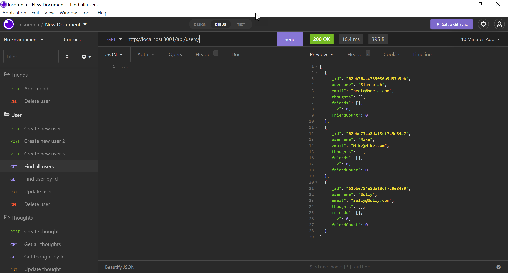

# Ubiquitous Octo Network

## Table of Contents
- [Description](#description)
- [License](#license)
- [Installation](#installation)
- [Usage](#usage)
- [Contributing](#contributing)
- [Tests](#test)
- [Questions](#questions)
- [Technologies](#technologies)

## Description
This interface is a Social Network API, using Node.js, Inquirer, and NoSQL. Manage thoughts and users in Insomnia. 

## License

## Installation
Clone the repository, then npm i, and npm run start. Make sure you have all the required dependencies, download Insomnia and MongoDB. 

## Usage
screenshot and video coming soon...

Click on this link to view it in action
[video](https://youtu.be/cDiMSgSa1g8)

## Contributing
Please see contact information below to inquire about contributing to this project.

## Tests
N/A

## Questions
This is my name and contact info. If you have questions, please reach out!
- :pencil2: Anita Chavez 
- :octocat: [Neeta525](https://github.com/Neeta525)
- :email: starry-days@hotmail.com

## Technologies

